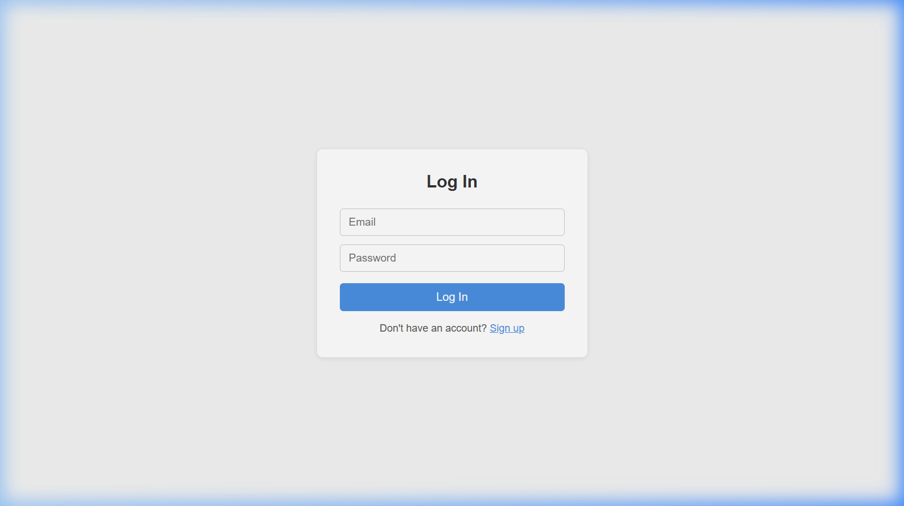
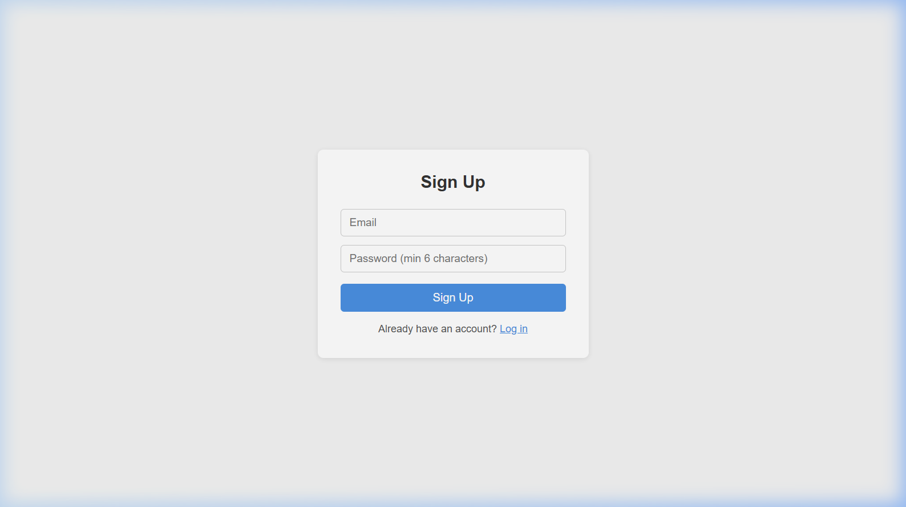

# Task Manager

Live Demo: https://full-stack-safety-net.vercel.app/

## Screenshots

## About This Project

A task manager web app where users can sign up, log in, and manage their own to-do list. Each user only sees their own tasks. You can add tasks with a due date, mark them as complete, and delete them. Tasks are split into "Pending" and "Completed" sections.

Built as a portfolio project to practice connecting a React frontend to a real backend (Firebase) with actual authentication and a database.

## Tech Stack

- React 18 (with Vite)
- Firebase Authentication (Email/Password)
- Firebase Firestore (database)
- Plain CSS (no framework)

## Features

- Email and password sign up / log in
- Each user's tasks are private — stored in Firestore with their user ID
- Add tasks with a title and optional due date
- Mark tasks complete / incomplete with a checkbox
- Delete tasks
- Pending and Completed sections update after every action
- Logs out with a single button click

## Challenges / What I Learned

**Connecting Firebase Auth for the first time** — I hadn't used Firebase before this project. Getting `onAuthStateChanged` to correctly track the logged-in user across page refreshes took some debugging. I learned how important it is to show a loading state while that initial auth check runs, otherwise the app flashes the login screen briefly even when a user is already signed in.

**Structuring Firestore so each user only sees their own tasks** — I had to figure out how to store the `userId` field on every task document and then query with `where("userId", "==", currentUser.uid)`. Without the matching security rules in the Firebase console, the query filtering alone wouldn't actually protect the data.

**Handling loading and error states for async calls** — Firebase calls are asynchronous, and early on I forgot to handle the loading state, which caused the UI to briefly render an empty list before data arrived. I added `isLoading` state and show "Loading tasks..." until the fetch is done.

## Run Locally

1. Clone the repo
2. Run `npm install`
3. Copy `.env.example` to `.env` and paste your own Firebase project config values
4. Run `npm run dev`

> You'll also need to set up your own Firebase project: enable Email/Password authentication under **Authentication → Sign-in method**, create a **Firestore database**, and set up security rules in the Firestore **Rules** tab.
